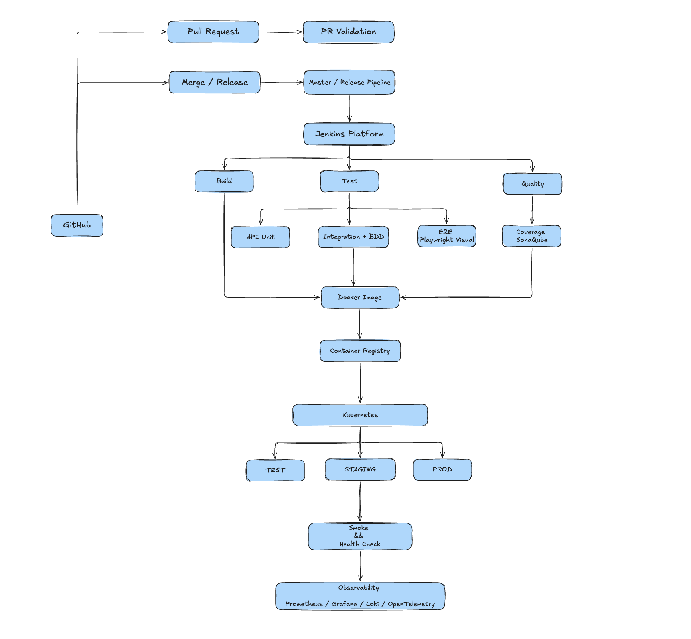

# Fullstack CI/CD & Test Automation Platform - V1

A production-oriented CI/CD and automated testing platform built around a [fullstack applicaiton](https://github.com/james-willett/bug-tracker), demonstrating how business-driven test strategies can be integrated into Jenkins, GitHub Enterprise, Docker, and Kubernetes workflows. 

The project focuses on **test orchestration, quality gates, scalable CI execution, Kubernetes deployment, and observability** rather than simply running a collection of automated tests. 

## Architecture




## Techstack 
### Application 
- React/TypeScript
- etcd
- Golang 


### CI/CD 
- Jenkins 
- Jenkins Multibranch Pipeline 
- Jenkins Shared Library 
- GitHub Action 
- Docker 
- Container Registry 
- Kubernetes 
- Helm 

### Automated Testing 
- Golang Unit
- Playwright 
- Cucumber / BDD 
- Serenity 
- Visual Regression Testing 
- JaCoCo 
- SnonarQube 
- OWASP Dependency-Check 
- k6

### Observability 
- Prometheus 
- Grafana 
- Loki 
- OpenTelemetry 
- Jaeger / Tempo 

## Test Strategy 
Tests are organized around test scenarios, rather than treating every test type as an independent pipeline. 

Test Type --> Test Suite --> Test Scenario --> Pipeline Policy --> Quality Gate 


## Test Types 
- Static Analysis 
- Unit Testing 
- API Testing 
- Integration Testing 
- Frontend Component Testing 
- BDD/Acceptance Testing 
- E2E Testing 
- Visual Regression 
- Smoke Testing 
- Sanity Testing 
- Regression Testing 
- Contract Testing 
- Security Testing 
- Performance Testing 
- Resilience / Chaos Testing

## Test Scenarios 

Different pipeline triggers use different test scopes. 

### PR Validation 
- Main Purpose: Fast developer feedback 
- Typical Tests: Static, Unit, API, Component, Integration 

### Master Validation 
- Main Purpose: Integration confidence 
- Typical Tests: Unit, API, Integration, BDD, E2E

### Nightly Regression 
- Main Purpose: Continuous regression detection 
- Typical Tests: Regression, BDD, E2E, Visual 

### Release Validation 
- Main Purpose: Release confidence 
- Typical Tests: Full Regression, E2E, Visual, Security 

### Performance 
- Main Purpose: Capacity validation 
- Typical Tests: Load, Stress, Spike, Soak 

### Production Smoke 
- Main Purpose: Deployment safety 
- Typical Tests: Health, Critical API, Critial UI 


> Here, nightly regression and release validaiton intentionally use different scopes. Nightly optimizes for continuous regression detection, while release validation maximizes production confidence. 


## CI/CD Flow 
### Pull Request 
PR -> Static Analysis -> Unit Tests -> Component Tests -> API / Integration Tests -> Coverage -> Code Quality -> GitHub Status Check 

### Master Merge 
Merge -> Build -> Unit / Integration / API -> BDD / E2E -> Quality Gates -> Docker Build -> Image Security Scan -> Push Image 

### Release 
Release Candidate -> Full Regression -> E2E / BDD / Visual -> Deploy Test -> Smoke Test -> Deploy STAGING -> Validation -> Manual Approval -> Deploy PROD -> Production Smoke Test 

### Nightly 
Scheduled Trigger -> Extended Regression -> BDD -> E2E -> Visual Regression -> Report -> Notification 

### Performance 
Performance Pipeline -> Load Test -> Stress Test -> Spike Test -> Latency / Throughput Analysis 


## Configurable Test Profiles 

Test execution is controlled through reusable profiles rather than hard-coded Jenkins stages. 

```
tests: 
  unit: true 
  api: true 
  integration: true 
  component: true
  bdd: true 
  e2e: false 
  visual: false 
  security: true
  performance: false 
```

Here are the example profiles: 
- PR
- MASTER 
- NIGHTLY
- RELEASE 
- PERFORMANCE
- SMOKE 


Mandatory tests are enforced by pipeline policy, while optional suites can be added according to the scenario. 

## Jenkins Platform 
Jenkins is deployed on Kubernetes with **dynamic ephemeral agents.**

Jenkins Controller --> Pipeline Queue --> Kubernetes Agent Pool -> {Agent, Agent, Agent, ...}

The platform is designed for: 
- Multi-team / multi-tenant pipelines 
- Isolated execution 
- Dynamic agent provisioning 
- RBAC and credential isolation 
- Pipeline failure recovery 
- Jenkins health monitoring 
- Persistent configuration and backup 


## Observability 
**The platform monitors both CI infrastructure and application runtime.**

### Jenkins 
- Queue length 
- Executor utilization 
- Build duration 
- Build success / failure rate 
- Agent provisioning time 
- Agent availability 
- Controller CPU / memory / JVM 
- Disk usage 

### Kubernetes
- Pod CPU / memory 
- Pod restarts 
- Pending pods 
- Node utilization 
- Agent failures 

### Application 
- Request rate 
- Latency 
- Error rate 
- Resource utilization 
- Logs 
- Distributed traces 

## Quality Gate 

The pipeline can enforce quality thresholds such as: 
Test Result -> Coverage -> Code Quality -> Security Scan -> Artifact Validation -> Deploy Validation.

Examples: 
- Minimum test coverage 
- No critcal quality violations 
- No blocking security vulnerabilities 
- Mandatory regression suites passed 
- Deployment health checks passed 


## Test Reporting & Notifications 
Each pipeline generates consolidated reports for: 
- Test results 
- Code coverage 
- Code quality 
- BDD / Serenity 
- Playwright 
- Visual regression 
- Security scanning 
- Performance metrics 

Failures provide actionable information including: 
- Pipeline 
- PR / Commit 
- Failed Stage 
- Failed Test Suite 
- Environment 
- Execution Duration 
- Report Link 

Notifications can be integrated with: 
- Discord 
- GitHub 
- Microsoft Teams 
- Slack 
- Email 

## Production Feedback Loop 

Production incidents are treated as inputs to the automated testing strategy. 

Production Incident -> Root Cause Analysis -> Missing Test Coverage -> Automated Test -> Regression Suite -> Pipeline Quality Gate -> Future Regression Prevention 

This creates a continuous feedback loop between **production risk and automated quality engineering**. 

## Engineering Principles 
### Build Once, Promote Many 
Build -> Test -> Docker Image -> Registry -> TEST -> STAGING -> PROD 

The same immutable image is promoted across environments. 

### Test According to Risk 
Not every pipeline executes every test. 

- PR        -> Fast Feedback 
- Master    -> Integration Confidence 
- Nightly   -> Regression Detection 
- Release   -> Production Confidence 
- Perf      -> Capacity Validation 

### Separate Test Types from Test Scenarios 

A **test type** describes how the system is tested. A **test scenario** describes why and when the validation is executed. 


### Treat CI as a Platform 

Jenkins is treated as a production engineering platform requiring: 
- Scalability 
- Reliability 
- Security 
- Observability 
- Fault tolerance 
- Backup / recovery 
- SLA monotiring 

---

## Project Goal 

The project aims to demonstrate an end-to-end capability to transform **business requirements and production risks into scalable, automated, observable, and enforceable quality gates** acorss the software delivery lifecycle. 

Business Risk -> Test Strategy -> Automated Tests -> Jenkins Pipeline -> Quality Gate -> Kubernetes Deployment -> Observability -> Production Safety. 
